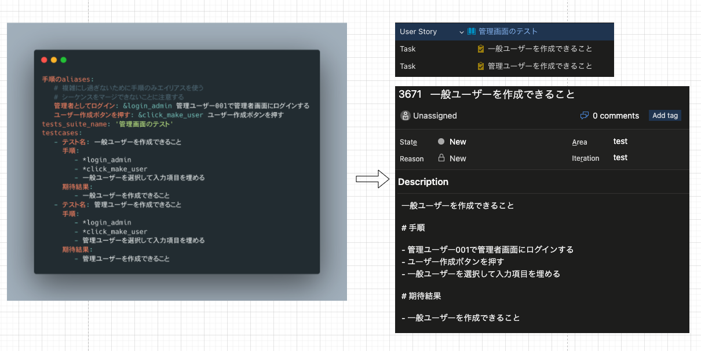

# yaml2devops-cli

yaml2devops-cli は yaml に記載したテストスイートの実行タスクを azure devops に起票できるツールです。



## 使い方

```shell
$ python3 -m venv venv
$ . venv/bin/activate
$ pip install yaml2devops
$ yaml2devops --file yaml2devops/sample_testcase.yaml --org <azure devops org name> --project <azure devops project_id>
# pat (AzureDevOps の Personal Access Token) を求められるので入力してください
```

- azure devops org name は AzureDevOps のURLの `https://dev.azure.com/<azure devops org name>` に当たる部分
- azure devops project_id は AzureDevOps のプロジェクトURLの AzureDevOps `https://dev.azure.com/<azure devops org name>/<azure devops project_id>` に当たる部分 

## 開発方法

以下手順を実行して、ローカルソースを利用した実行ができます。

```shell
$ cd yaml2devops
$ poetry shell
$ poetry run yaml2devops
```

## publish

`poetry publish` を実行。  
`poetry publish` したら user と password の確認が求められます。  
https://cocoatomo.github.io/poetry-ja/repositories/